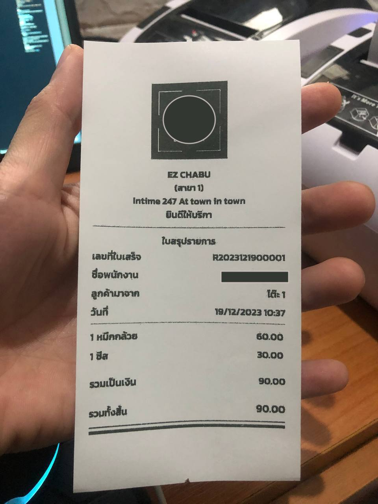

# react-native-savanitdev-thermal-printer

## Support

| Expo | :heavy_check_mark:
| React Native CLI | :heavy_check_mark:

| Implement | Android            | IOS                |
| --------- | ------------------ | ------------------ |
| Base64    | :heavy_check_mark: | :heavy_check_mark: |

## Support

| Printer    | Android            | IOS                |
| ---------- | ------------------ | ------------------ |
| BLEPrinter | :heavy_check_mark: | coming soon        |
| NetPrinter | :heavy_check_mark: | :heavy_check_mark: |

<br />
<div style="display: flex; flex-direction: row; align-self: center; align-items: center">


</div>

## Installation

```
npm i react-native-savanitdev-thermal-printer

```

or

```
yarn add react-native-savanitdev-thermal-printer

```

next step

```
-> React Native CLI Add below code in AndroidManifest.xml

 <service android:name="net.posprinter.service.PosprinterService"/>

-> EXPO create android-manifest.plugin.js and copy below to android-manifest.plugin.js you created. don't forgot add => "plugins": ["./android-manifest.plugin"] in app.json

const { withAndroidManifest } = require("@expo/config-plugins");

// add this code for auto add in manifest android
module.exports = function androiManifestPlugin(config) {
  return withAndroidManifest(config, async (config) => {
    let androidManifest = config.modResults.manifest;
    androidManifest.application[0]["service"] = {
      $: {
        "android:name": "net.posprinter.service.PosprinterService",
      },
    };

    return config;
  });
};


```

## Example

**`Print Columns Text`**

```
npm i esc-pos-encoder

```

```tsx
import EscPosEncoder from "esc-pos-encoder";
import { Buffer } from "buffer";

useEffect(() => {
  if (Platform.OS === "android") {
    onCreate();
  }
}, []);

const printRaw = () => {
  let encoder = new EscPosEncoder();
  let result = encoder
    .table(
      [
        { width: 36, marginRight: 2, align: "left" },
        { width: 10, align: "right" },
      ],
      [
        ["Item 1", "€ 10,00"],
        ["Item 2", "15,00"],
        ["Item 3", "9,95"],
        ["Item 4", "4,75"],
        ["Item 5", "211,05"],
        ["", "=".repeat(10)],
        ["Total", (encoder) => encoder.bold().text("€ 250,75").bold()],
      ]
    )
    .encode();
  const base64string = Buffer.from(result).toString("base64");
  printRawData(base64string, "your ip printer");
};
```

**`Print image`**

```tsx
const printImg = () => {
  if (Platform.OS === "android") {
    // for IOS if you got error when print image please check your size of your image it's just limit 10-20mb
    printImgNet("192.168.1.xxx", "your image base64string");
  } else {
    // for android
    printImgNet("192.168.1.xxx", "your image base64string", 576, 576);
  }
};
```

**`Print Loop different IP printer`**

```tsx
// example for IOS
const printLoop = () => {
  for (let i = 0; i < ListIPPrinter.length; i++) {
    const res = ListIPPrinter[i];
    connectNet(res.ip)
      .then((e: any) => {
        printTest(res.ip);
      })
      .catch((err: any) => {
        // do something
      });
  }
};

// example for android
const printLoop = () => {
  for (let i = 0; i < ListIPPrinter.length; i++) {
    const res = ListIPPrinter[i];
    await new Promise((resolve) => {
      connectNet(res.ip_address)
        .then((e) => {
          setTimeout(() => {
            printImgBase64(base64, 576, 576)
              .finally(() => {
                setTimeout(resolve, 500);
              })
              .catch((e) => {
                console.log("error print =>", e);
              });
          }, 500);
          setTimeout(() => {
            printRawData(base64string)
              .finally(() => {
                setTimeout(resolve, 500);
              })
              .catch((e) => {
                console.log("error print =>", e);
              });
          }, 500);
        })
        .catch((err) => {
          setTimeout(resolve, 0);
        });
    });
  }
};
```

## Support Me by give Star


## FAQ Support

you can contact me directly [Telegram](@dev_la), feedback your problem  

